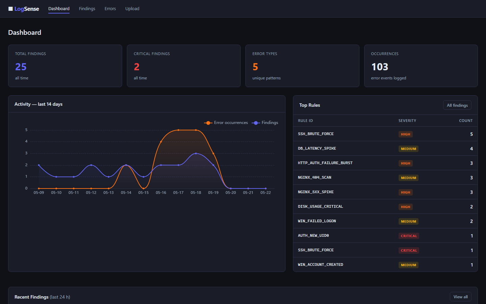

# Logatory

[](https://github.com/T0nd3/logatory/actions/workflows/ci.yml)
[](LICENSE)
[](https://www.python.org/downloads/)

**Local log analysis with PII redaction, rule-based threat detection, anomaly detection, LLM-powered insights, and a web dashboard — all running on your machine, no data leaves your infrastructure by default.**



Or stay in the terminal — format auto-detected, PII redacted, threats flagged:

```text
$ logatory scan tests/data/auth.log
------------------------------------------------------------
  Source   : tests/data/auth.log
  Format   : auth_log
  Events   : 7
  PII hits : 5 (mode: redact)
  Findings : 1
------------------------------------------------------------

  Events (7 of 7):

  [    1] 2026-05-18 10:00:01  INFO      Accepted publickey for admin from ip_8390373f port 52341 ssh2
  [    2] 2026-05-18 10:00:15  WARNING   Failed password for invalid user guest from ip_2bcf3253 port 22 ssh2
  [    3] 2026-05-18 10:00:16  WARNING   Failed password for invalid user guest from ip_2bcf3253 port 22 ssh2
  [    4] 2026-05-18 10:00:17  WARNING   Failed password for invalid user guest from ip_2bcf3253 port 22 ssh2
  [    5] 2026-05-18 10:01:00  INFO      admin : TTY=pts/0 ; PWD=/home/admin ; USER=root ; COMMAND=/bin/systemctl restart nginx
  [    6] 2026-05-18 10:01:30  INFO      new user: name=deploy, UID=1002, GID=1002, home=/home/deploy, shell=/bin/bash
  [    7] 2026-05-18 10:02:00  INFO      Disconnected from ip_8390373f port 52341

  Findings (1):

  [LOW] 2026-05-18 10:01:00  sudo_misuse  Sudo Command to Root: admin : TTY=pts/0 ; PWD=/home/admin ; USER=root ; COMMAND=/bin/systemctl restart nginx
```

The IP addresses above (`ip_8390373f`, …) are deterministic pseudonyms — the same IP always maps to the same token, so correlation survives while the raw value never reaches storage. This example is reproducible: the log file ships with the repo.

---

## Table of Contents

- [Features](#features)
- [Quick Start](#quick-start)
- [Installation](#installation)
- [CLI Reference](#cli-reference)
  - [scan](#scan)
  - [Docker container logs](#docker-container-logs)
  - [tail](#tail)
  - [serve](#serve)
  - [findings](#findings)
  - [errors](#errors)
  - [rules](#rules)
  - [anomaly](#anomaly)
  - [llm](#llm)
  - [opensearch](#opensearch)
  - [export](#export)
  - [demo](#demo)
- [Configuration](#configuration)
- [PII Redaction](#pii-redaction)
- [Detection Rules](#detection-rules)
- [Plugin System](#plugin-system)
- [Anomaly Detection](#anomaly-detection)
- [LLM Integration](#llm-integration)
- [Web Dashboard & REST API](#web-dashboard--rest-api)
- [Docker](#docker)
- [Contributing](#contributing)

---

## Features

| Capability | Details |
|---|---|
| **Format support** | Syslog, Nginx access/error, JSON Lines, Windows Event Log (EVTX), plaintext — auto-detected |
| **PII redaction** | Emails, IPs, credit cards, phone numbers, UUIDs, JWTs, SSH keys — deterministic pseudonymisation or masking |
| **Rule engine** | YAML-based rules with `contains`, `regex`, `startswith`, `endswith`, `gte`, `lte` operators; multi-field AND/OR |
| **Sigma support** | Convert Sigma rules to native format |
| **Anomaly detection** | Statistical Z-score baseline over 60-second buckets, trains automatically from historical logs |
| **LLM integration** | Ollama (default), Claude, OpenAI-compatible APIs; explain findings, summarize errors, RAG Q&A |
| **Web dashboard** | FastAPI + HTMX; findings/errors table, trend chart (ECharts), inline LLM explain, log file upload |
| **Log upload** | Drag-and-drop log upload in the browser — instant scan with PII redaction, results shown inline |
| **REST API v1** | Bearer-token auth, JSON endpoints for findings, errors, stats, live event ingestion |
| **OpenSearch** | Query and analyse logs from OpenSearch / Elasticsearch clusters |
| **Finding persistence** | SQLite store for HIGH/CRITICAL findings with retention, dedup, severity filtering |
| **FP suppression** | Dismiss rules globally or per source file; reversible |
| **Markdown export** | Automated security reports from the SQLite database |
| **Plugin system** | Drop Python files into a directory to add custom rules and PII patterns |
| **Docker** | Multi-stage image, non-root user, `/data` volume — production-ready |

---

## Quick Start

```bash
# Install (core only — no external dependencies beyond PyYAML and typer)
pip install logatory

# Scan a log file
logatory scan /var/log/syslog

# Watch a file in real time
logatory tail /var/log/nginx/access.log

# Start the web dashboard
pip install 'logatory[web]'
logatory serve
```

That's it. Open `http://localhost:8080` in your browser.

---

## Installation

**Requirements:** Python 3.11+

### Core only

```bash
pip install logatory
```

Includes: file scanning, PII redaction, rule engine, anomaly detection, findings persistence, Markdown export, plugin system.

### Optional feature sets

```bash
pip install 'logatory[web]'         # web dashboard + REST API (FastAPI, uvicorn, Jinja2)
pip install 'logatory[docker]'      # read logs from local Docker containers
pip install 'logatory[opensearch]'  # OpenSearch / Elasticsearch integration
pip install 'logatory[evtx]'        # Windows Event Log (.evtx) support
pip install 'logatory[claude]'      # Anthropic Claude API
pip install 'logatory[embed]'       # ChromaDB for RAG (llm ask command)
```

Install everything:

```bash
pip install 'logatory[web,docker,opensearch,evtx,claude,embed]'
```

### Shell auto-completion

```bash
logatory --install-completion    # bash / zsh / fish / PowerShell
```

---

## CLI Reference

All commands accept `--config/-c <path>` to specify a config file. Defaults to `config.yaml` in the working directory.

---

### scan

Parse a log file (or stdin), redact PII, run detection rules, and optionally persist errors and findings.

```bash
logatory scan [OPTIONS] [PATH]
```

| Option | Default | Description |
|---|---|---|
| `PATH` | stdin | Log file to scan. Use `-` explicitly for stdin. |
| `--config/-c` | `config.yaml` | Config file path. |
| `--redact` | `redact` | PII handling: `redact` (hash), `mask` (`<TYPE>`), `dry-run` (show only). |
| `--limit/-n` | `50` | Max events to display in output. |
| `--all` | off | Display all events (ignores `--limit`). |
| `--format-only` | off | Print detection summary and exit, skip event listing. |
| `--no-rules` | off | Skip the rule engine entirely. |
| `--rules-dir` | — | Additional YAML rules directory. |
| `--track-errors` | off | Persist error groups and HIGH/CRITICAL findings to SQLite. |
| `--detect-anomalies` | off | Run statistical anomaly detection against the trained baseline. |
| `--anomaly-source` | file stem | Override the baseline source key. |
| `--anomaly-threshold` | `3.0` | Z-score threshold for anomaly alerts. |
| `--explain-findings` | off | Ask the LLM to explain up to 3 HIGH/CRITICAL findings. |
| `--classify` | off | Ask the LLM to classify a sample of events by severity. |

**Examples**

```bash
# Basic scan with PII masking
logatory scan /var/log/auth.log --redact mask

# Scan a gzip-compressed file and persist results
logatory scan /var/log/nginx/access.log.gz --track-errors

# Read from stdin (e.g. pipe from journalctl)
journalctl -n 1000 | logatory scan -

# Scan with anomaly detection after training the baseline
logatory anomaly learn /var/log/syslog --source syslog
logatory scan /var/log/syslog --detect-anomalies --anomaly-source syslog

# Explain the worst findings with Ollama
logatory scan /var/log/auth.log --track-errors --explain-findings
```

---

### Docker container logs

No log aggregation stack (ELK, Loki, Graylog) required — if your services
run in Docker, Logatory reads their logs straight from the daemon. Install
the optional dependency and use the native `docker` command:

```bash
pip install 'logatory[docker]'

# Scan all running containers
logatory docker scan

# One container, by name; persist errors
logatory docker scan --name my-service --track-errors

# Filter by label, include stopped containers
logatory docker scan --label app=web --all
```

Each event is auto-detected per container (JSON, Nginx, plaintext, …),
PII-redacted, and tagged with its container name.

> Realtime follow (`logatory docker tail`) is on the way. Until then, for a
> single container you can pipe: `docker logs -f my-service | logatory scan -`.

---

### tail

Watch a log file for new lines in real time. Applies PII redaction and detection rules to every incoming event. Press **Ctrl+C** to stop.

```bash
logatory tail [OPTIONS] PATH
```

| Option | Default | Description |
|---|---|---|
| `PATH` | — | Log file to watch (required). |
| `--redact` | `redact` | PII mode: `redact`, `mask`, `dry-run`. |
| `--from-start` | off | Start from the beginning of the file instead of the tail. |
| `--no-rules` | off | Skip rule engine. |
| `--rules-dir` | — | Extra rules directory. |
| `--track-errors` | off | Persist new errors to SQLite. |
| `--track-findings` | off | Persist HIGH/CRITICAL findings to SQLite. |
| `--alert-webhook` | — | POST findings as JSON to this URL. |
| `--alert-min-severity` | `high` | Minimum severity for webhook: `low` \| `medium` \| `high` \| `critical`. |
| `--poll-interval` | `0.2` | File poll interval in seconds. |

Dismissed rules (see [`findings dismiss`](#findings)) are filtered out in real time — no spurious alerts for known false positives.

**Examples**

```bash
# Watch nginx access log and send critical findings to a webhook
logatory tail /var/log/nginx/access.log \
  --track-findings \
  --alert-webhook https://hooks.example.com/security \
  --alert-min-severity high

# Read from the beginning and don't bother persisting
logatory tail /var/log/auth.log --from-start --no-rules
```

---

### serve

Start the Logatory web dashboard (requires `pip install 'logatory[web]'`).

```bash
logatory serve [OPTIONS]
```

| Option | Default | Description |
|---|---|---|
| `--host` | `127.0.0.1` | Bind address. Use `0.0.0.0` to expose on all interfaces. |
| `--port/-p` | `8080` | Port to listen on. |
| `--config/-c` | `config.yaml` | Config file. |
| `--reload` | off | Auto-reload on source file changes (development mode). |

```bash
logatory serve --port 9090
```

Open `http://localhost:8080` to access the dashboard, or `http://localhost:8080/api/docs` for the interactive REST API documentation.

---

### findings

Browse and manage HIGH/CRITICAL findings persisted by `scan --track-errors` or `tail --track-findings`.

```bash
logatory findings [list|show|summary|dismiss|undismiss|dismissed]
```

#### `findings list`

```bash
logatory findings list [--severity high] [--source nginx.log] [--since 7d] [-n 100]
```

`--since` accepts `s`, `m`, `h`, `d` suffixes: `30m`, `24h`, `7d`, `30d`.

#### `findings show <RULE_ID>`

Show all stored occurrences for a specific rule:

```bash
logatory findings show SSH_BRUTE_FORCE
logatory findings show SSH_BRUTE_FORCE -n 50
```

#### `findings summary`

Print counts by severity and the top 10 rules:

```bash
logatory findings summary
```

#### `findings dismiss <RULE_ID>`

Suppress a rule so future scans and tail sessions skip it:

```bash
# Global false-positive — suppress everywhere
logatory findings dismiss SSH_BRUTE_FORCE --reason "internal bastion host"

# Suppress only for one source file
logatory findings dismiss NGINX_404_SCAN --source nginx.log --reason "internal scanner"
```

#### `findings undismiss <RULE_ID>`

Re-enable a suppressed rule:

```bash
logatory findings undismiss SSH_BRUTE_FORCE
```

#### `findings dismissed`

List all currently active suppressions:

```bash
logatory findings dismissed
```

---

### errors

Browse deduplicated error groups tracked by `scan --track-errors`.

```bash
logatory errors [list|show|new|regression]
```

#### `errors list`

```bash
logatory errors list [--sort last_seen|count|first_seen] [--severity error] [-n 50]
```

#### `errors show <FINGERPRINT>`

Show details and the 20 most recent occurrences for an error fingerprint:

```bash
logatory errors show abc123def456
```

#### `errors new`

Show errors first seen within a time window — useful for catching regressions after a deploy:

```bash
logatory errors new --since 1h
```

#### `errors regression`

Show errors that reappeared after a silence period:

```bash
logatory errors regression --silence 24h
```

---

### rules

Manage and validate detection rules.

```bash
logatory rules list [--rules-dir ./my-rules]

logatory rules validate my_rule.yml
logatory rules validate sigma_rule.yml --sigma
```

---

### anomaly

Train and manage the statistical anomaly detection baseline.

```bash
logatory anomaly [learn|status|reset]
```

#### `anomaly learn`

Feed a log file into the baseline. Run this several times on representative logs. At least **5 time buckets** are needed before the baseline is considered trained.

```bash
logatory anomaly learn /var/log/syslog --source syslog
logatory anomaly learn /var/log/nginx/access.log --source nginx --bucket 300
```

#### `anomaly status`

Show baseline training state for all known source keys:

```bash
logatory anomaly status
```

#### `anomaly reset`

Delete baseline data for one source key or all sources:

```bash
logatory anomaly reset --source syslog
logatory anomaly reset --all
```

Once the baseline is trained, enable detection during scan:

```bash
logatory scan /var/log/syslog --detect-anomalies --anomaly-source syslog --anomaly-threshold 2.5
```

---

### llm

LLM-powered log analysis. Supports **Ollama** (default, local), **Claude** (Anthropic), and any **OpenAI-compatible** API.

```bash
logatory llm [info|explain|summarize|ask|index]
```

#### `llm info`

Check provider connectivity and list available models:

```bash
logatory llm info
```

#### `llm explain <FINGERPRINT>`

Explain a tracked error in plain language:

```bash
logatory llm explain abc123def456
```

#### `llm summarize`

Generate a natural-language summary of recent errors:

```bash
logatory llm summarize --since 24h
```

#### `llm ask <QUESTION>`

Ask questions about your findings and errors using RAG over the local SQLite database:

```bash
# Build the vector index first (requires pip install 'logatory[embed]')
logatory llm index

# Then ask freely
logatory llm ask "What are the most critical security issues from the past week?"
logatory llm ask "Which source files had the most brute-force attempts?"
```

> **Privacy note:** LLM queries use *redacted* log data. When using a cloud provider (Claude, OpenAI), a warning is shown before any data is sent.

---

### opensearch

Query and analyse logs from an OpenSearch or Elasticsearch cluster.

```bash
logatory opensearch scan [OPTIONS]
logatory opensearch info
```

Configure the connection in `config.yaml` under the `opensearch:` key (see [Configuration](#configuration)). Credentials can be set via environment variables to avoid storing them in the config file.

```bash
# Check cluster connectivity
logatory opensearch info

# Run detection rules on the last 2 hours of logs
logatory opensearch scan --index "logstash-*" --since 2h --track-errors
```

---

### export

Generate reports from the SQLite database.

```bash
logatory export report [OPTIONS]
```

| Option | Default | Description |
|---|---|---|
| `--output/-o` | `report.md` | Output file path. |
| `--since` | `168h` (7 days) | Look-back window: `24h`, `7d`, `30d`, etc. |
| `--severity` | all | Minimum severity filter. |
| `--title` | `Logatory Security Report` | Report title. |
| `--open` | off | Open the report in the system default app after writing. |

```bash
# Weekly security report
logatory export report --since 7d --output weekly.md --open

# Critical-only daily report
logatory export report --since 24h --severity critical --title "Daily Critical Alerts"
```

---

### demo

Interactive demo and database seeding using synthetic data — no real log files, Ollama, or database required for `demo run`.

```bash
logatory demo [run|seed|clear]
```

#### `demo run`

Guided CLI walkthrough of all 7 feature sections (log parsing, PII, rules, error tracking, findings, anomaly detection, LLM):

```bash
logatory demo run           # pause after each section
logatory demo run --no-pause  # print everything at once
```

#### `demo seed`

Populate the SQLite database with synthetic findings and errors so the **web dashboard** has something to display immediately. Inserts 25 findings spread over 14 days (for the trend chart) and 5 error groups. All records are tagged internally and never mixed with real data.

```bash
logatory demo seed
```

#### `demo clear`

Remove every record written by `demo seed`. Real findings and errors are never touched.

```bash
logatory demo clear
```

---

## Configuration

Copy `config.yaml.example` to `config.yaml` and adapt:

```yaml
# SQLite database for findings, errors, and baselines
db_path: logatory.db        # use /data/logatory.db inside Docker

# Custom PII patterns file (optional)
pii_rules_path: pii_rules.yaml

# Salt for deterministic PII pseudonymisation
# Prefer env var LOGATORY_PII_SALT over storing here
pii_salt: ""

# REST API Bearer token — leave empty to disable auth (local dev)
# Prefer env var LOGATORY_API_TOKEN
api_token: ""

# Plugin directory — all *.py files here are auto-loaded at startup
# plugins_dir: plugins/

# Findings persistence behaviour
# findings_retention_days: 30
# findings_min_severity: high   # low | medium | high | critical

llm:
  provider: ollama              # ollama | claude | openai
  model: gemma3:4b
  endpoint: http://localhost:11434
  temperature: 0.1
  max_context_tokens: 8000
  # api_key: ""                 # set via LLM_API_KEY env var for cloud providers

opensearch:
  host: localhost
  port: 9200
  use_ssl: false
  verify_certs: true
  # Credentials — always prefer env vars:
  #   OPENSEARCH_USERNAME / OPENSEARCH_PASSWORD
  #   OPENSEARCH_API_KEY
  #   OPENSEARCH_CLIENT_CERT / OPENSEARCH_CLIENT_KEY / OPENSEARCH_CA_CERTS
  default_index: "logstash-*"
  timestamp_field: "@timestamp"
  message_field: "message"
  severity_field: "level"
  source_name_field: "host.name"
```

### Environment variables

| Variable | Description |
|---|---|
| `LOGATORY_PII_SALT` | Salt for PII pseudonymisation |
| `LOGATORY_API_TOKEN` | Bearer token for REST API auth |
| `OPENSEARCH_USERNAME` | OpenSearch basic auth username |
| `OPENSEARCH_PASSWORD` | OpenSearch basic auth password |
| `OPENSEARCH_API_KEY` | OpenSearch API key (`id:base64key`) |
| `OPENSEARCH_CLIENT_CERT` | Path to client certificate |
| `OPENSEARCH_CLIENT_KEY` | Path to client private key |
| `OPENSEARCH_CA_CERTS` | Path to CA certificate bundle |
| `LOGATORY_CONFIG` | Config file path used by `logatory serve --reload` |

---

## PII Redaction

PII redaction runs on every log line before analysis. Three modes are available via `--redact`:

| Mode | Behaviour | Use case |
|---|---|---|
| `redact` (default) | Replaces PII with a salted HMAC hash: `<email_a3f7c1>` | Preserves correlation across events |
| `mask` | Replaces PII with a generic tag: `<email>` | Maximum anonymity |
| `dry-run` | Reports PII hits without changing the text | Audit what would be redacted |

**Built-in patterns:** email addresses, IPv4/IPv6, credit cards (Luhn-validated), phone numbers (international), UUIDs, JWTs, SSH private keys.

### Custom PII patterns

Add patterns in `pii_rules.yaml`:

```yaml
patterns:
  - name: employee_id
    pattern: '\bEMP-\d{4,8}\b'
    prefix: employee   # produces <employee_abc123>

  - name: order_id
    pattern: '\bORD-[A-Z0-9]{8,12}\b'
    prefix: order
```

Or register patterns via the [Plugin System](#plugin-system).

---

## Detection Rules

Rules live in `logatory/rules/builtin/` (shipped) or any YAML file you point to with `--rules-dir`.

### Built-in rules

| ID | Severity | Triggers on |
|---|---|---|
| `SSH_BRUTE_FORCE` | high | Multiple SSH auth failures from one host |
| `SUDO_MISUSE` | high | `sudo: auth failure` / `sudo: user NOT in sudoers` |
| `AUTH_NEW_UID0` | critical | New UID 0 account created |
| `NGINX_404_SCAN` | medium | High rate of 404 responses (scanner pattern) |
| `NGINX_5XX_SPIKE` | high | Multiple 5xx errors in a short window |
| `WIN_FAILED_LOGON` | medium | Windows Event ID 4625 (failed logon) |
| `WIN_ACCOUNT_CREATED` | medium | Windows Event ID 4720 (account created) |

### Writing custom rules

```yaml
id: MY_RULE_001
title: "Sensitive file accessed"
description: "Fires when /etc/passwd is accessed via nginx"
level: high     # low | medium | high | critical
detection:
  match:
    - field: message
      op: contains
      value: "/etc/passwd"
    - field: message
      op: regex
      value: 'GET\s+/etc/passwd'
  condition: any   # any (OR) | all (AND, default)
```

**Supported operators:** `contains`, `not_contains`, `regex`, `not_regex`, `startswith`, `endswith`, `equals`, `gte`, `lte`.

Validate a rule before using it:

```bash
logatory rules validate my_rule.yml
```

### Sigma rules

Import a Sigma rule and convert it to the native format:

```bash
logatory rules validate sigma_rule.yml --sigma
```

---

## Plugin System

Drop Python files into a directory and register custom rules and PII patterns. Enable in `config.yaml`:

```yaml
plugins_dir: plugins/
```

A plugin file must expose a `register(registry)` function:

```python
# plugins/my_plugin.py

def register(registry) -> None:
    # Custom detection rule
    registry.add_rule({
        "id": "MY_DB_LEAK",
        "title": "Database credentials exposed in log",
        "description": "Fires when a connection string appears in a log message.",
        "level": "critical",
        "detection": {
            "match": [
                {"field": "message", "op": "regex", "value": r"postgresql://\S+:\S+@"},
            ]
        },
    })

    # Custom PII pattern — redacts internal employee IDs
    registry.add_pii_pattern(
        name="employee_id",
        pattern=r"\bEMP-\d{4,8}\b",
        prefix="employee",
    )

    # Load an entire directory of YAML rule files
    from pathlib import Path
    registry.add_rule_dir(Path(__file__).parent / "my_rules")
```

Plugin rules participate in both `logatory scan`, `logatory tail`, and the web dashboard rule engine. Plugin PII patterns apply to every redaction pass. A plugin that raises an exception is logged as a warning and skipped — it never crashes the host process.

---

## Anomaly Detection

Logatory uses a statistical Z-score baseline to detect unusual log activity without writing any rules. Features tracked per 60-second bucket: total event count, error rate, warning rate.

**Training workflow:**

```bash
# Step 1: Feed representative logs (repeat for several days of data)
logatory anomaly learn /var/log/syslog --source syslog

# Step 2: Check training state
logatory anomaly status
# shows: syslog → 42 observations  trained ✓

# Step 3: Enable detection in scan or tail
logatory scan /var/log/syslog --detect-anomalies --anomaly-source syslog
```

At least **5 time buckets** are required before the baseline is used. The baseline grows automatically every time you scan with `--detect-anomalies` — no separate training step is needed once you're in production.

Adjust sensitivity with `--anomaly-threshold` (default: `3.0` standard deviations):

```bash
# More sensitive
logatory scan /var/log/syslog --detect-anomalies --anomaly-threshold 2.0

# Less sensitive
logatory scan /var/log/syslog --detect-anomalies --anomaly-threshold 4.0
```

---

## LLM Integration

### Ollama (recommended — fully local)

```bash
# Install and start Ollama: https://ollama.ai
ollama pull gemma3:4b

# Default config already points to http://localhost:11434
logatory llm info
```

### Claude (Anthropic)

```yaml
# config.yaml
llm:
  provider: claude
  model: claude-3-5-haiku-20241022
```

```bash
export LLM_API_KEY=sk-ant-...
logatory llm info
```

### OpenAI-compatible APIs

```yaml
llm:
  provider: openai
  model: gpt-4o-mini
  endpoint: https://api.openai.com/v1
```

```bash
export LLM_API_KEY=sk-...
```

> When using a cloud provider, Logatory prints a warning before sending any redacted data to the external API.

---

## Web Dashboard & REST API

Start the server (requires `pip install 'logatory[web]'`):

```bash
logatory serve --port 8080
```

### Dashboard pages

| URL | Description |
|---|---|
| `/` | Overview with 14-day trend chart and quick stats |
| `/findings` | Findings table with severity filter, inline LLM explain |
| `/errors` | Error group table with frequency and recency sorting |
| `/upload` | Drag-and-drop log file upload with instant scan results |

### Log file upload

Navigate to `/upload` in the browser to scan any log file without leaving the dashboard:

- **Drag-and-drop** or click to browse — `.log`, `.txt`, `.gz`, `.json`
- Choose PII mode: **Redact** (pseudonymize), **Mask** (`<TYPE>`), or **Dry-run**
- Results appear inline (no page reload): stat cards, findings table sorted by severity, 20-event sample
- **Nothing is persisted** — purely transient analysis; use `logatory scan --track-errors` to save results
- Maximum upload size: **10 MB**

### REST API v1

Base path: `/api/v1/`  
Interactive docs: `/api/docs`

| Method | Path | Description |
|---|---|---|
| `GET` | `/api/v1/health` | Liveness probe (no auth) |
| `GET` | `/api/v1/findings` | List findings (`?severity=high&since_hours=24&source=nginx.log`) |
| `GET` | `/api/v1/findings/{id}` | Get finding by ID |
| `GET` | `/api/v1/errors` | List error groups (`?sort=count`) |
| `GET` | `/api/v1/errors/{fingerprint}` | Get error group + recent occurrences |
| `GET` | `/api/v1/stats` | Aggregate counts |
| `POST` | `/api/v1/events` | Ingest a raw log line → returns triggered findings |

**Authentication**

Set `api_token` in `config.yaml` or via `LOGATORY_API_TOKEN`. Pass it as:

```
Authorization: Bearer <token>
```

Leave empty to disable auth (for local development or Docker with network-level access control).

**Event ingestion example**

```bash
curl -X POST http://localhost:8080/api/v1/events \
  -H "Authorization: Bearer mytoken" \
  -H "Content-Type: application/json" \
  -d '{"raw": "Failed password for root from 1.2.3.4 port 22", "source": "sshd"}'
```

---

## Docker

### Quick start

```bash
docker compose up -d
```

The stack starts Logatory on port `8080` with a named volume for the SQLite database.

### Environment variables for Docker

```bash
# docker-compose.yml (or .env file)
LOGATORY_API_TOKEN=change-me-in-production
LOGATORY_PII_SALT=a-long-random-string
```

### Build and run manually

```bash
docker build -t logatory .

docker run -d \
  -p 8080:8080 \
  -v logatory-data:/data \
  -e LOGATORY_API_TOKEN=mytoken \
  -e LOGATORY_PII_SALT=mysalt \
  logatory
```

The container runs as a non-root user (`logatory`, UID 1001). The database and config are stored in `/data`.

### Scanning log files inside Docker

Mount the host log directory and run a one-shot scan:

```bash
docker run --rm \
  -v /var/log:/logs:ro \
  -v logatory-data:/data \
  logatory \
  logatory scan /logs/syslog --track-errors
```

### Demo data for the web dashboard

Seed the database with synthetic findings and errors so the dashboard shows data immediately:

```bash
# Populate (25 findings over 14 days + 5 error groups)
docker compose exec logatory logatory demo seed

# Remove all demo data (real data is untouched)
docker compose exec logatory logatory demo clear
```

Alternatively, upload a real log file via the browser at `http://localhost:8080/upload` for an instant, transient scan.

---

## Contributing

Contributions are welcome. See **[CONTRIBUTING.md](CONTRIBUTING.md)** for the
development setup, the test and lint workflow, the project layout, and how to
submit changes.

Security issues: please follow the **[Security Policy](SECURITY.md)** — do not
open a public issue.
